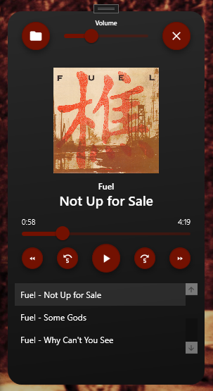

# Music Player

## Key Features
- **Add MP3 Files**: Button to load one or more MP3 files into the playlist.
- **Volume Control**: Slider to adjust the audio volume.
- **Media Playback Controls**:
  - Play/Pause
  - Skip to the next or previous track
  - Rewind and fast-forward within a track
- **Song Information Display**: Shows the current song’s title, artist, and album cover.
- **Album Art Support**: Displays album art from the `cover.png` or `cover.jpg` located in the same folder as the MP3 files.
- **Progress Slider**: A timeline slider to navigate within a song.
- **Track Duration Display**: Shows both the current playback time and total track length.
- **Playlist View**: List of loaded tracks with the ability to select songs directly from the list.

## Usage Instructions
1. **Main Interface**: Upon launching, the main interface includes buttons and controls for interacting with audio files.
2. **Loading Songs**: Use the "Add" button to select and load MP3 files.
3. **Playback Controls**: Utilize the play/pause, next/previous track, and rewind/fast-forward buttons to manage playback.
4. **Volume and Timeline Sliders**: Adjust the volume or navigate within a track using the respective sliders.
5. **Album Art**: Ensure the `cover.png` or `cover.jpg` file is present in the folder containing your MP3 files for album art display.
6. **Playlist**: Click on any song in the playlist to start playback.

## Requirements
- **Supported File Types**: Only `.mp3` files are supported.
- **Album Art**: The album art file must be named `cover.png` or `cover.jpg`.

## Dependencies
- [NAudio Library](https://github.com/naudio/NAudio)
- [Material Design Themes](http://materialdesigninxaml.net/)

## Credits
UI design modified and adapted from [alihaider11/Music-App](https://github.com/alihaider11/Music-App).
